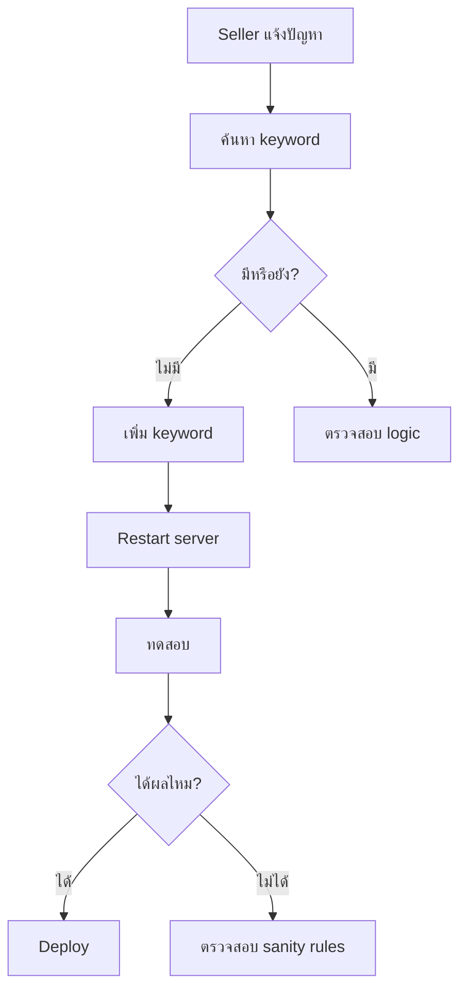

# 🚀 Keywords Management - Quick Start

เริ่มต้นใช้งาน Keywords Management System ใน 5 นาที!

---

## ⚡ Installation

```bash
# ติดตั้ง dependencies (ถ้ายังไม่มี)
npm install ts-node @types/node
```

---

## 📖 Common Tasks

### 1️⃣ ค้นหา Keyword

**ต้องการหา:** "ปั๊มลม" อยู่ไฟล์ไหน?

```bash
npm run search:keywords "ปั๊มลม"
```

**Output:**
```
✅ Found 2 occurrence(s)

📁 comprehensive-automotive-keywords.ts
Line 288:
Category: automotive
Subcategory: Car Maintenance (109)
Code: 'ปั๊มลม', 'air pump', 'เติมลม',
```

---

### 2️⃣ วิเคราะห์ความครอบคลุม

**ต้องการรู้:** หมวดไหนต้องเพิ่ม keywords?

```bash
npm run analyze:coverage
```

**Output:**
```
📊 KEYWORDS COVERAGE ANALYSIS

✅ Excellent (500+): 3
🟢 Good (300-499): 5
🟡 Fair (100-299): 4
🟠 Poor (1-99): 2

💡 Categories needing more keywords:
   15. Kids & Toys - Need 250 more keywords
```

---

### 3️⃣ รับคำแนะนำอัตโนมัติ

**ต้องการรู้:** ควรเพิ่ม keywords อะไรบ้าง?

```bash
npm run suggest:keywords
```

**Output:**
```
💡 Found 12 suggested keywords:

1. "ปั๊มลมกางกา xiaomi"
   Category: Automotive (1)
   Frequency: 8 times
   → Add to comprehensive-automotive-keywords.ts
```

---

### 4️⃣ ทดสอบหลังเพิ่ม Keywords

**หลังเพิ่มแล้ว:** ทดสอบว่าได้ผลไหม?

```bash
# เปิด Testing UI
npm run test:classification
# → Open http://localhost:3000/test-classification
```

---

## 📝 Step-by-Step Example

### สถานการณ์: "Canon Card Printer" ไปหมวด Camera ❌

**ขั้นตอนแก้ไข:**

#### 1. ค้นหาว่ามี keyword หรือยัง
```bash
npm run search:keywords "card printer"
```

#### 2. ถ้าไม่มี → เพิ่ม keyword

```typescript
// src/lib/comprehensive-computer-keywords.ts

405: [ // Printers
    // Card Printers - เพิ่ม 2025-12-18
    'เครื่องพิมพ์บัตร',
    'card printer',
    'pvc printer',
    'id card printer',
    
    // Existing...
    'ปริ้นเตอร์',
    'printer'
]
```

#### 3. Restart dev server
```bash
# Ctrl+C
npm run dev
```

#### 4. ทดสอบ
```bash
npm run test:classification
```

#### 5. ตรวจสอบผลลัพธ์
```
✅ "Canon Card Printer" → Computer ✅
   Confidence: 95%
```

---

## 🎯 Best Practices

### ✅ DO

```typescript
// 1. เพิ่มทั้งไทยและอังกฤษ
'ปั๊มลม',
'air pump',

// 2. เพิ่ม variations
'ปั๊มลมกางกา',
'tire inflator',
'air compressor',

// 3. เพิ่ม common typos
'ปั้มลม',  // ผิดจาก ปั๊มลม
'ที่เติมลม',

// 4. เพิ่ม brand context
'xiaomi air pump',
'canon card printer',

// 5. เพิ่ม comment
// Air pumps - Added 2025-12-18 (Issue #123)
```

### ❌ DON'T

```typescript
// ❌ แค่คำเดียว (กว้างเกิน)
'pump',  // จะ match ทุกอย่างที่มี pump

// ❌ ไม่มี context
'canon',  // กล้อง? ปริ้นเตอร์? สแกนเนอร์?

// ❌ ไม่มี comment
'asdfgh',  // ??? คืออะไร

// ❌ ไม่ export
const HIDDEN = ['keyword']  // ไม่มีใครเห็น
```

---

## 🔧 Workflow



---

## 💡 Tips & Tricks

### Tip 1: ค้นหาแบบ Multi-word

```bash
# ค้นหา "air" และ "pump"
npm run search:keywords "air pump"

# ค้นหาแค่ "air"
npm run search:keywords "air"
```

### Tip 2: Export Suggestions เป็นไฟล์

```bash
npm run suggest:keywords 30
# → สร้าง keyword-suggestions.ts
```

### Tip 3: ดู Coverage ก่อนเพิ่ม

```bash
npm run analyze:coverage | grep "Poor\|None"
# → แสดงหมวดที่ต้องเพิ่ม keywords
```

### Tip 4: Test เฉพาะ Air Pump

```typescript
// src/lib/test-air-pump.ts
const result = decideCategoryWithAI({
    title: 'ปั๊มลมกางกา Air Pump',
    description: '...'
})
console.log(result)
```

---

## 📞 Support Checklist

ก่อนขอความช่วยเหลือ ตรวจสอบ:

- [ ] ค้นหา keyword แล้วหรือยัง? (`npm run search:keywords`)
- [ ] ตรวจสอบ coverage แล้วหรือยัง? (`npm run analyze:coverage`)
- [ ] Restart server แล้วหรือยัง? (Ctrl+C → `npm run dev`)
- [ ] ทดสอบแล้วหรือยัง? (`/test-classification`)
- [ ] ดู console logs แล้วหรือยัง?

---

## 🎓 Next Steps

1. ✅ อ่าน [Full Documentation](./KEYWORDS_GUIDE.md)
2. ✅ ดู [Classification System](./CLASSIFICATION_SYSTEM.md)
3. ✅ ทำ [Testing UI](http://localhost:3000/test-classification)
4. ✅ ดู [Analytics](http://localhost:3000/analytics/classification)

---

**เวลาอ่าน:** 5 นาที  
**ความยาก:** ⭐⭐☆☆☆  
**Last Updated:** 2025-12-18
