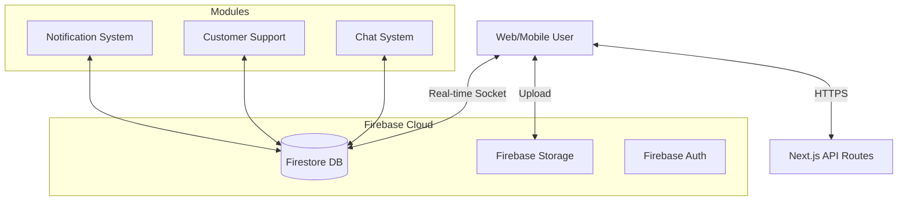

# JaiKod Messaging & Notification System Architecture

## 1. System Architecture

เราใช้ **Serverless Architecture** บน Firebase ecosystem เพื่อความรวดเร็วและความสามารถ Real-time โดยกำเนิด

*   **Frontend**: Next.js (Client-side logic)
*   **Database**: Cloud Firestore (NoSQL, Real-time updates)
*   **Real-time**: Firestore Listeners (`onSnapshot`)
*   **Storage**: Firebase Storage (Images, Slips)
*   **Auth**: Firebase Auth
*   **Backend Logic**: Next.js API Routes / Firebase Cloud Functions (สำหรับ Notification Triggers)



---

## 2. ER Diagram & Database Schema (Firestore)

### 2.1 Users Collection (`users`)
เพิ่มฟิลด์สำหรับสถานะ Online
```json
{
  "uid": "user_123",
  "displayName": "John Doe",
  "role": "buyer | seller | admin | support",
  "isOnline": true,            // Status
  "lastSeen": Timestamp,       // Last active
  "pushToken": "fcm_token..."  // For Push Notifications
}
```

### 2.2 Conversations Collection (`conversations`)
รองรับทั้ง Chat ซื้อขาย และ Support
```json
{
  "id": "conv_abc",
  "type": "ORDER | SUPPORT | NORMAL",
  "participants": ["user_123", "seller_456"],
  "relatedId": "order_789 or ticket_001", // Link to Context
  "lastMessage": "สินค้ายังมีอยู่ไหมครับ",
  "lastMessageAt": Timestamp,
  "unreadCount": {
    "user_123": 0,
    "seller_456": 1
  },
  "status": "OPEN | CLOSED | ARCHIVED"
}
```

### 2.3 Messages Collection (`messages`)
```json
{
  "id": "msg_xyz",
  "conversationId": "conv_abc",
  "senderId": "user_123",
  "type": "TEXT | IMAGE | SLIP | SYSTEM",
  "content": "สวัสดีครับ / https://storage...",
  "isRead": false,
  "readBy": ["user_123"], // Read Receipt
  "createdAt": Timestamp
}
```

### 2.4 Support Tickets Collection (`support_tickets`)
```json
{
  "id": "ticket_001",
  "userId": "user_123",
  "subject": "แจ้งปัญหาการชำระเงิน",
  "status": "OPEN | IN_PROGRESS | RESOLVED | CLOSED",
  "priority": "LOW | MEDIUM | HIGH",
  "assignedTo": "support_agent_99",
  "createdAt": Timestamp,
  "updatedAt": Timestamp
}
```

### 2.5 Notifications Collection (`notifications`)
```json
{
  "id": "notif_555",
  "userId": "user_123",
  "type": "MESSAGE | ORDER_UPDATE | SYSTEM | PROMOTION",
  "title": "มีข้อความใหม่",
  "body": "ร้านค้าตอบกลับคุณแล้ว...",
  "link": "/chat?id=conv_abc",
  "isRead": false,
  "createdAt": Timestamp
}
```

---

## 3. API Specification & Methods

เนื่องจากเราใช้ Firebase SDK ที่ Client-side เป็นหลัก โค้ดส่วนใหญ่จะเป็น Function ใน `src/lib` แทน REST API

### 3.1 Chat Module (`src/lib/chat.ts`)

*   `startOrderChat(buyerId, sellerId, orderId)`: เริ่มแชทจากออเดอร์
*   `sendMessage(convId, senderId, content, type)`: ส่งข้อความ (Text/Image)
*   `markAsRead(convId, userId)`: อ่านข้อความ
*   `uploadChatImage(file)`: อัปโหลดรูปภาพ

### 3.2 Support Module (`src/lib/support.ts`)

*   `createTicket(userId, subject, details)`: เปิด Ticket ใหม่
*   `getTicketHistory(userId)`: ดูประวัติ Ticket
*   `replyToTicket(ticketId, senderId, message)`: ตอบกลับใน Ticket (ใช้ระบบ Chat)
*   `closeTicket(ticketId, byUserId)`: ปิดงาน

### 3.3 Notification Module (`src/lib/notifications.ts`)

*   `getMyNotifications(userId)`: ดึงการแจ้งเตือน
*   `markNotificationRead(notifId)`: กดอ่าน
*   `subscribeToNotifications(userId, callback)`: Real-time alert

---

## 4. Implementation Plan

### Phase 1: Core Chat Enhancements
1.  Update `Conversation` schema to support `type` (ORDER, SUPPORT).
2.  Add `isOnline` status tracking logic.
3.  Implement Image Upload in Chat UI.

### Phase 2: Customer Support System
1.  Create `SupportTicket` type and logic.
2.  Create Support Dashboard UI (`/support`).

### Phase 3: Notification System
1.  Create Notification Center UI (Dropdown in Header).
2.  Implement Trigger logic (e.g., Send notification when message received).

---

